# Tasker

A lightweight React + Vite application for managing tasks (to‑dos).
This demo project showcases basic task operations including add, edit, delete, favorite and search, all handled entirely in browser state.

---

## 📌 Features

- Create, edit and delete tasks
- Mark tasks as favorite
- Search tasks by title
- Delete all tasks with confirmation
- Responsive layout using utility‑first CSS
- Modular component design for easy extension

## 🛠 Tech Stack

- **React** (JSX, hooks)
- **Vite** for fast development builds
- Tailwind‑style utility classes for styling
- Vanilla JavaScript (no backend)

## 🚀 Getting Started

### Prerequisites

- Node.js (>=14) and npm/yarn

### Installation

```bash
# clone repository
git clone <your-repo-url>
cd Tasker

# install dependencies
npm install
# or
# yarn install
```

### Running Locally

```bash
npm run dev
# or
# yarn dev
```

Open `http://localhost:5173` (or the port shown) in your browser to view the app.

### Building for Production

```bash
npm run build
# or
# yarn build
```

The optimized output will be in `dist/`.

## 🗂 Project Structure

```
src/
  App.jsx           # root component
  main.jsx          # entry point
  Header.jsx        # site header
  Hero.jsx          # marketing section
  Footer.jsx        # site footer
  task/
    TaskBoard.jsx   # state container and logic
    TaskAction.jsx  # add/delete-all UI
    TaskList.jsx    # renders list of tasks
    AddTaskModal.jsx# form modal for add/edit
    SearchTask.jsx  # search input
    NoTaskFound.jsx # empty-state message
```

## 🏗 Architecture Diagram

```mermaid
flowchart TD
  %% =========================
  %% Context / Deployment
  %% =========================
  Dev["Developer Workstation"]:::external
  Browser["User Browser"]:::external
  StaticHost["Static Web Host<br/>(e.g., Vercel/Netlify/S3+CDN)"]:::external

  %% =========================
  %% Build / Dev Tooling (Repo)
  %% =========================
  subgraph "Build & Dev Tooling (Vite + NPM)"
    direction TB

    Repo["Project Repository"]:::group

    subgraph "Configuration & Metadata"
      direction TB
      Pkg["package.json<br/>(scripts,dependencies)"]:::config
      Lock["package-lock.json<br/>(dependency lock)"]:::config
      ViteCfg["vite.config.js<br/>(bundler config)"]:::config
      ESLintCfg["eslint.config.js<br/>(lint rules)"]:::config
      JSConfig["jsconfig.json<br/>(module resolution hints)"]:::config
      VSCode[".vscode/<br/>(editor settings)"]:::config
    end

    subgraph "Entry Template & Static Assets"
      direction TB
      IndexHtml["index.html<br/>(HTML entry template)"]:::artifact
      PublicDir["public/<br/>(static copied assets)"]:::artifact
    end

    subgraph "Source (React)"
      direction TB
      Main["src/main.jsx<br/>(bootstrap & mount)"]:::source
      App["src/App.jsx<br/>(composition root)"]:::source
      AppCss["src/App.css"]:::source
      IndexCss["src/index.css"]:::source
      Assets["src/assets/"]:::source
    end

    subgraph "Dev/Build Outputs"
      direction TB
      DevServer["Vite Dev Server<br/>(HMR)"]:::tool
      BuildStep["vite build<br/>(bundle static assets)"]:::tool
      Dist["Built Static Assets<br/>(JS/CSS/HTML/assets)"]:::artifact
    end
  end

  %% =========================
  %% Runtime: React SPA in Browser
  %% =========================
  subgraph "Runtime Container: React SPA (Browser)"
    direction TB

    subgraph "App Shell"
      direction TB
      Header["Header"]:::ui
      Hero["Hero"]:::ui
      Footer["Footer"]:::ui
    end

    subgraph "Task Feature Module (src/task)"
      direction TB
      TaskBoard["TaskBoard<br/>(feature container)"]:::uiContainer

      TaskState[("Task State (in-memory)<br/>tasks[],filterQuery,modalOpen,...")]:::state

      subgraph "Task UI Components"
        direction TB
        SearchTask["SearchTask"]:::ui
        TaskAction["TaskAction"]:::ui
        TaskList["TaskList"]:::ui
        NoTaskFound["NoTaskFound"]:::ui
        AddTaskModal["AddTaskModal"]:::ui
      end
    end
  end

  %% =========================
  %% Relationships: Dev/Build/Deploy
  %% =========================
  Dev -->|"edit_code"| Repo
  Repo -->|"npm_run_dev"| DevServer
  DevServer ==>|"serve+HMR"| Browser

  Repo -->|"npm_run_build"| BuildStep
  BuildStep -->|"emits"| Dist
  Dist -->|"deploy"| StaticHost
  StaticHost ==>|"HTTP_GET:index.html+bundles"| Browser

  %% Boot sequence (runtime)
  IndexHtml -->|"loads_bundle"| Main
  Main -->|"renders"| App

  %% =========================
  %% Relationships: UI composition
  %% =========================
  App -->|"compose"| Header
  App -->|"compose"| Hero
  App -->|"compose"| TaskBoard
  App -->|"compose"| Footer

  %% TaskBoard owns state
  TaskBoard -->|"owns"| TaskState

  %% Props down (solid)
  TaskBoard -->|"props"| SearchTask
  TaskBoard -->|"props"| TaskAction
  TaskBoard -->|"props"| TaskList
  TaskBoard -->|"props"| NoTaskFound
  TaskBoard -->|"props"| AddTaskModal

  %% Events up (dashed)
  SearchTask -.->|"query_change"| TaskBoard
  TaskAction -.->|"open_modal/sort_actions"| TaskBoard
  TaskList -.->|"select/update/delete"| TaskBoard
  AddTaskModal -.->|"submit/cancel"| TaskBoard

  %% Styling/assets feed into bundle (build-time linkage)
  AppCss -->|"bundled_into"| Dist
  IndexCss -->|"bundled_into"| Dist
  Assets -->|"bundled_into"| Dist
  PublicDir -->|"copied_to"| Dist
  ViteCfg -->|"controls_build"| BuildStep
  Pkg -->|"scripts_drive"| DevServer
  Pkg -->|"scripts_drive"| BuildStep
  ESLintCfg -->|"lint_rules"| Repo

  %% =========================
  %% Click events (component_mapping)
  %% =========================
  click ViteCfg "https://github.com/fahadbinsiddique/tasker/blob/main/vite.config.js"
  click Pkg "https://github.com/fahadbinsiddique/tasker/blob/main/package.json"
  click Lock "https://github.com/fahadbinsiddique/tasker/blob/main/package-lock.json"
  click ESLintCfg "https://github.com/fahadbinsiddique/tasker/blob/main/eslint.config.js"
  click VSCode "https://github.com/fahadbinsiddique/tasker/tree/main/.vscode/"
  click JSConfig "https://github.com/fahadbinsiddique/tasker/blob/main/jsconfig.json"
  click IndexHtml "https://github.com/fahadbinsiddique/tasker/blob/main/index.html"
  click PublicDir "https://github.com/fahadbinsiddique/tasker/tree/main/public/"
  click Main "https://github.com/fahadbinsiddique/tasker/blob/main/src/main.jsx"
  click App "https://github.com/fahadbinsiddique/tasker/blob/main/src/App.jsx"
  click AppCss "https://github.com/fahadbinsiddique/tasker/blob/main/src/App.css"
  click IndexCss "https://github.com/fahadbinsiddique/tasker/blob/main/src/index.css"
  click Header "https://github.com/fahadbinsiddique/tasker/blob/main/src/Header.jsx"
  click Hero "https://github.com/fahadbinsiddique/tasker/blob/main/src/Hero.jsx"
  click Footer "https://github.com/fahadbinsiddique/tasker/blob/main/src/Footer.jsx"
  click Assets "https://github.com/fahadbinsiddique/tasker/tree/main/src/assets/"
  click TaskBoard "https://github.com/fahadbinsiddique/tasker/blob/main/src/task/TaskBoard.jsx"
  click TaskList "https://github.com/fahadbinsiddique/tasker/blob/main/src/task/TaskList.jsx"
  click AddTaskModal "https://github.com/fahadbinsiddique/tasker/blob/main/src/task/AddTaskModal.jsx"
  click SearchTask "https://github.com/fahadbinsiddique/tasker/blob/main/src/task/SearchTask.jsx"
  click TaskAction "https://github.com/fahadbinsiddique/tasker/blob/main/src/task/TaskAction.jsx"
  click NoTaskFound "https://github.com/fahadbinsiddique/tasker/blob/main/src/task/NoTaskFound.jsx"

  %% Also click for module directory
  click TaskState "https://github.com/fahadbinsiddique/tasker/tree/main/src/task/"

  %% =========================
  %% Styles
  %% =========================
  classDef external fill:#F3F4F6,stroke:#6B7280,color:#111827,stroke-width:1px
  classDef group fill:#EEF2FF,stroke:#4F46E5,color:#111827,stroke-width:1px
  classDef tool fill:#E5E7EB,stroke:#374151,color:#111827,stroke-width:1px
  classDef config fill:#FEF3C7,stroke:#B45309,color:#111827,stroke-width:1px
  classDef artifact fill:#E0F2FE,stroke:#0369A1,color:#0B1220,stroke-width:1px
  classDef source fill:#DBEAFE,stroke:#1D4ED8,color:#0B1220,stroke-width:1px
  classDef ui fill:#CFFAFE,stroke:#0891B2,color:#0B1220,stroke-width:1px
  classDef uiContainer fill:#99F6E4,stroke:#0F766E,color:#0B1220,stroke-width:1px
  classDef state fill:#DCFCE7,stroke:#166534,color:#0B1220,stroke-width:1px
```

<details>
<summary>Click to expand architecture diagram</summary>



</details>

## 🤝 Contributing

Contributions are welcome! Open an issue or submit a pull request. Please follow standard GitHub conventions and include meaningful commit messages.

## 📄 License

This project is open source under the **MIT License**. See [LICENSE](LICENSE) for details.

## ✉️ Contact

Created by Fahad Bin Siddique. Feel free to reach out via GitHub.
